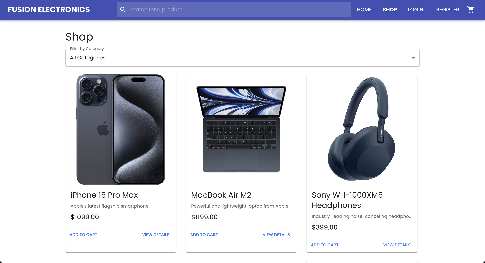
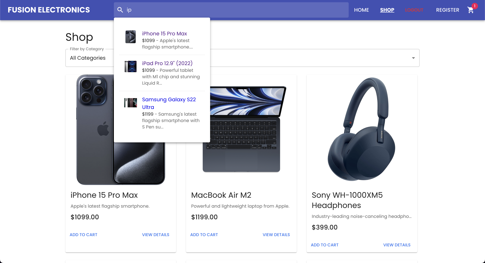
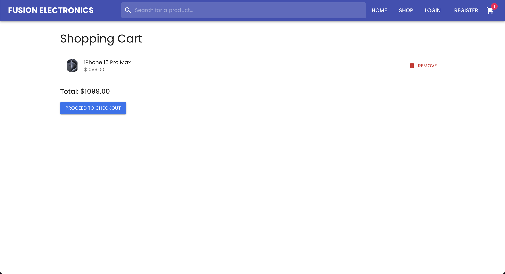
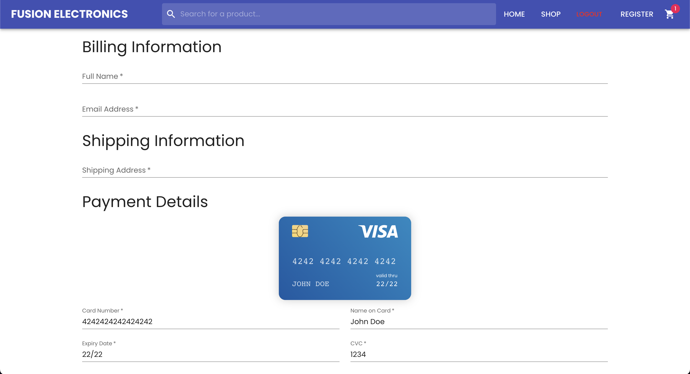
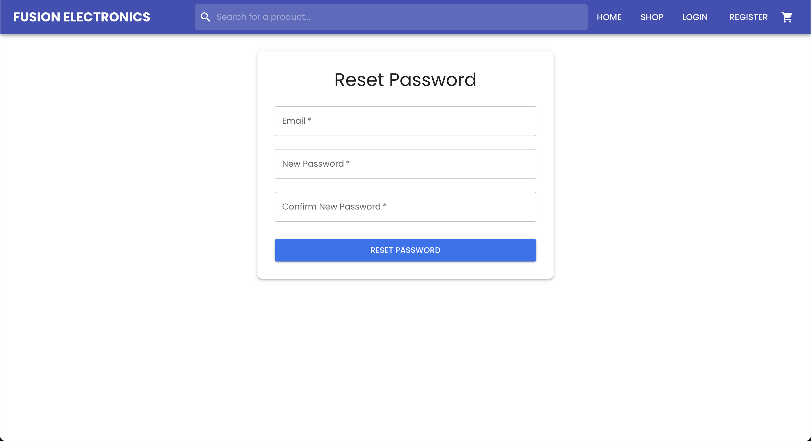

# Fusion Electronics: A MERN-Stack E-commerce Application

Welcome to **Fusion Electronics**, a **MERN-Stack E-commerce Application**! This project is a working demo of a full-stack web application that was built using the MERN stack (MongoDB, Express.js, React.js, Node.js). It aims to provide a comprehensive example of building a modern e-commerce platform, covering frontend user interface, backend server logic, database management, and integration with third-party libraries.

## Introduction

This project is a demonstration of building an e-commerce application using the MERN stack, which consists of MongoDB (database), Express.js (server), React.js (frontend), and Node.js (runtime environment). The application allows users to browse products, add them to a shopping cart, proceed to checkout, and simulate the order processing. It includes basic validations for user inputs and simulates the checkout process on the backend.

## User Interface

### Home Page

    

### Full Product List

    

### Search Results

    

### Product Details Page

    

### Cart Page

    

### Checkout Page

    

### Login Page

    

### Register Page

    

### Forgot Password Page

    

### Reset Password Page

    

### Order Confirmation

    

### Footer

    

## Features

- **Product Management:**
    - View a list of products.
    - View detailed product information.
    - Add products to the shopping cart.

- **Shopping Cart:**
    - View items in the shopping cart.
    - Remove items from the cart.
    - Calculate total amount of items in the cart.

- **Checkout Process:**
    - Enter billing, shipping, and payment information.
    - Simulate the order creation process on the backend.
    - Receive confirmation of order success.

## Technologies Used

- **Frontend:**
    - React.js
    - Material-UI for styling
    - Axios for API requests
    - `react-credit-cards-2` for credit card visualization
    - `react-router-dom` for routing
    - `react-hook-form` for form validation
    - `react-toastify` for toast notifications
    - Jest and React Testing Library for testing

- **Backend:**
    - Node.js
    - Express.js
    - MongoDB (with Mongoose ODM)
    - Axios for external API requests
    - JsonWebToken for user authentication
    - Bcrypt for password hashing
    - Dotenv for environment variables
    - Cors for cross-origin resource sharing
    - Swagger for API documentation
    - Nodemon for server hot-reloading
    - **Middleware**: JWT for securing API endpoints

- **Development Tools:**
    - Jetbrains WebStorm (IDE)
    - Postman (for API testing)
    - Git (version control)
    - npm (package manager)

## Creator

- **Email:** [vickykumar90069@gmail.com](mailto:vickykumar90069@gmail.com).

